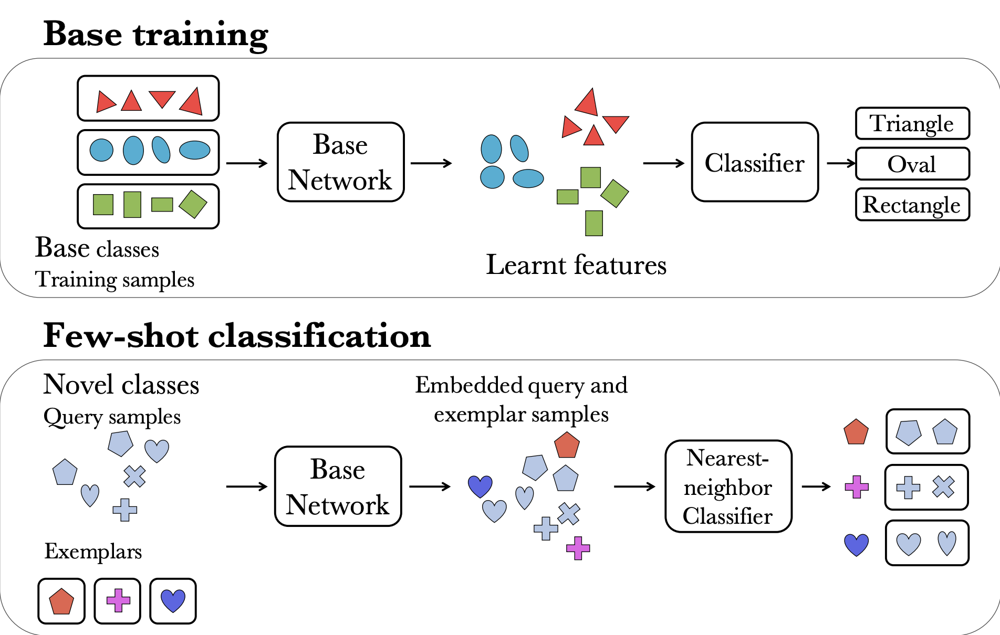
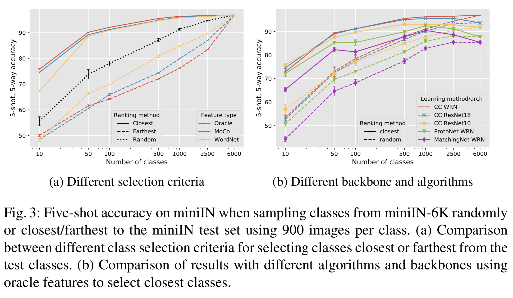
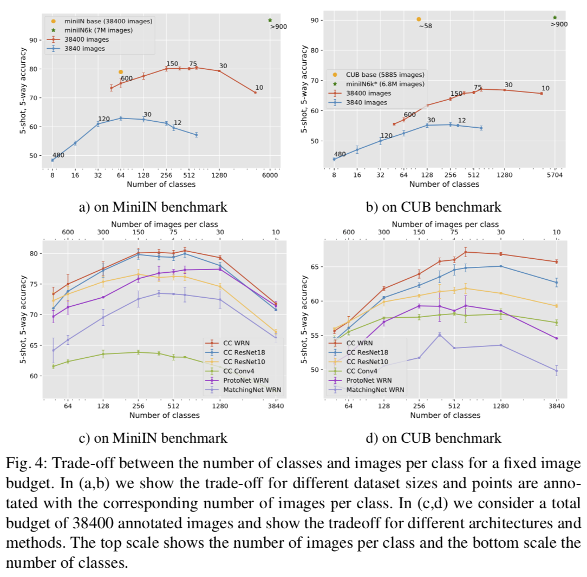
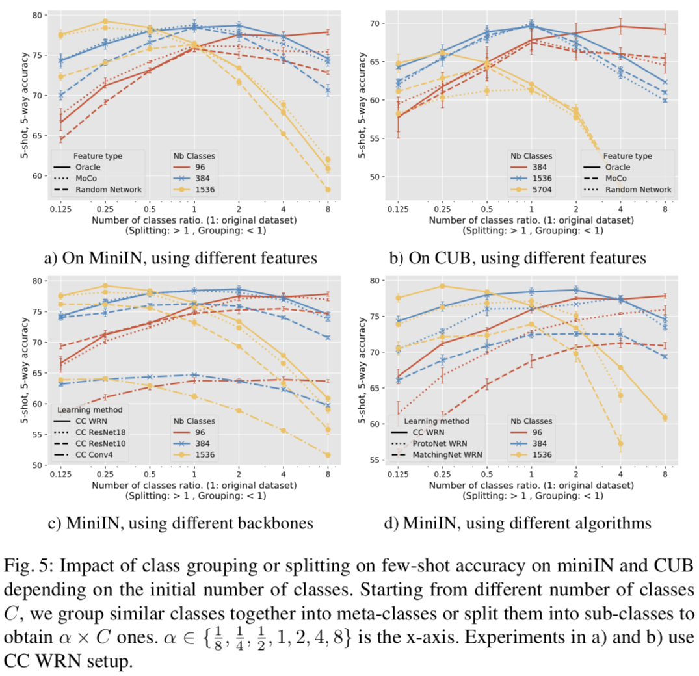

# Dataset Design for FewShot Learning

(ECCV 2020) This code is aimed at reproducing the results and figures in the ECCV 2020 paper: Impact of base dataset design on few-shot image classification - [project webpage](http://imagine.enpc.fr/~sbaio/fewshot_dataset_design).

Our paper presents a systematic empirical study about the impact of the base dataset on the few-shot classification performance using given features. We rely on a simple but effective baseline: Nearest-Neighbors (NN) with L2-normalized features, usually named Cosine Classifier.

Our main contribution is to demonstrate the importance of dataset design in few-shot performance and to give insights about improving it by going beyond the natural dataset labeling and better exploiting class richness in favor of creating more difficult classification tasks. 

Furthermore, our paper gives insights on important aspects of few-shot evaluation. Especially, considering the gain from using more data and the influence of farthest base classes to test ones.

To do that, we sample datasets from a large meta-dataset of 6000 classes (miniIN6k), then we compare the obtained performance on different benchmarks (miniIN, CUB, ...).



## 0. Requirements
```
pytorch, torchvision, tensorboardX, faiss
scipy, json
```

## 1. Datasets
We provide instructions for downloading datasets used in this paper.

### MiniImagenet
MiniImagenet few-shot benchmark consists of 100 categories of 600 images each. 64 for training, 16 for validation and 20 for testing.

``` Bash
cd data
bash download_miniimagenet.sh # Download Mini-ImageNet dataset
```
This dataset contains the original Mini-ImageNet proposed in Matching Networks.

[Original split](https://github.com/yaoyao-liu/mini-imagenet-tools/tree/master/csv_files)

### CUB

CUB benchmark is composed of 200 bird categories with 100 for training (5,885 images), 50 for validation (2,950 images) and 50 for test (2,953 images).
``` Bash
cd data
bash download_cub.sh # Download CUB dataset
```
We split this dataset for the few-shot learning task 
as proposed in [Closer Look](https://github.com/wyharveychen/CloserLookFewShot).

[Split origin](https://github.com/wyharveychen/CloserLookFewShot/tree/master/filelists/CUB)


### IN6k dataset

We create the IN6k dataset from IN22k by first cleaning classes by automatically removing duplicates. Then by selecting the largest 6k classes excluding IN1k classes. 

We provide a json file of all classes and sample names present in our IN6k dataset in the [IN6k.json](https://drive.google.com/file/d/1flqZCRdnk0cdgXnXjOJXhUS9N9k_K-jt/view?usp=sharing). 

The IN6k samples from filtered classes with respect to CUB test classes are provided in [IN6k_cub.json](https://drive.google.com/file/d/1UyUE1jycnI3baA4ykoUWHc7mWoB43uxx/view?usp=sharing).

## 2. Training

To run a training, you can run the following commands.
```
from utils import get_opts
from trainer import Trainer

opt = get_opts()

opt.train_type = 'CC' # cosine classifier
opt.benchmark = 'miniIN' # eval benchmark options are: 'miniIN','cub'
opt.dataset = 'miniIN' # training dataset options are 'miniIN','cub' or can be passed to Trainer init as argument
opt.arch = 'resnet18' # architecture options: 'wrn','resnet18','conv4' ...

trainer = Trainer(opt)

trainer.train() # run training and evaluation
```

## 3. Exps

In [train_submitit.ipynb](train_submitit.ipynb), we provide commands for launching multiple experiments of each table and figure in the paper. 


## 4. Results

### a. Importance of base data and its similarity to test data

The similarity between training classes and test classes influences the few-shot performance, regardless of the features (Oracle, MoCo or Wordnet) considered, the backbones chosen (WideResNet, ResNet18, ...)  or the training algorithm (Prototypical networks, matching Networks or cosine classifier)




### b. Effect of the number of classes for a fixed number of annotations

There is an important trade-off between the number of classes and the number of images for a fixed dataset budget, which determines the optimal performance achieved by random classes sampled from a large dataset.



### c. Redefining classes

Few-shot performance can be improved by relabeling images in each class (splitting classes) or by grouping different classes into meta-classes, depending on the initial trade-off between the number of classes and images per class.



## License

You may find out more about the license [here](LICENSE).

## 5. Citing this work

SBAI, Othman, COUPRIE, Camille, et AUBRY, Mathieu. Impact of base dataset design on few-shot image classification. ECCV 2020

